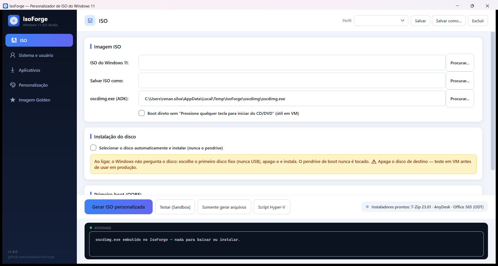
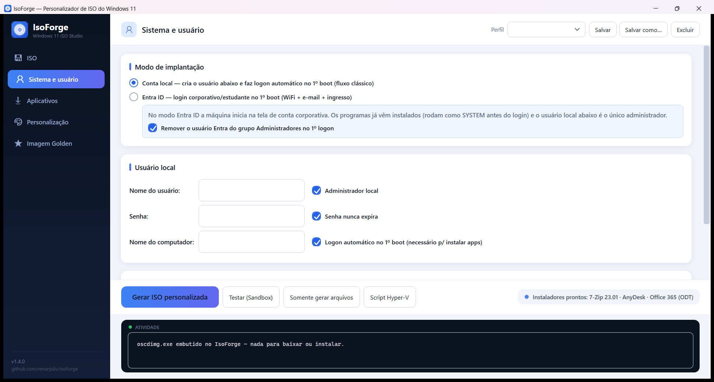
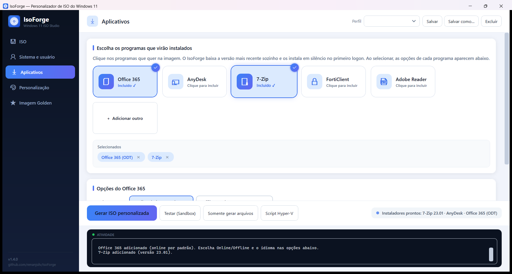
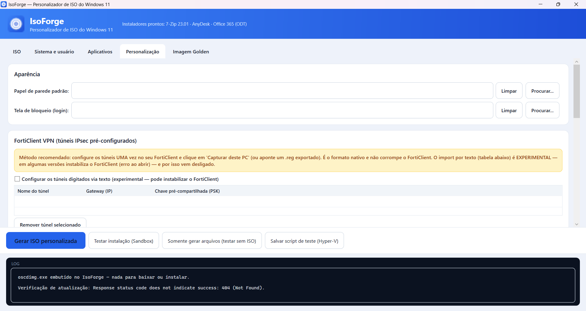
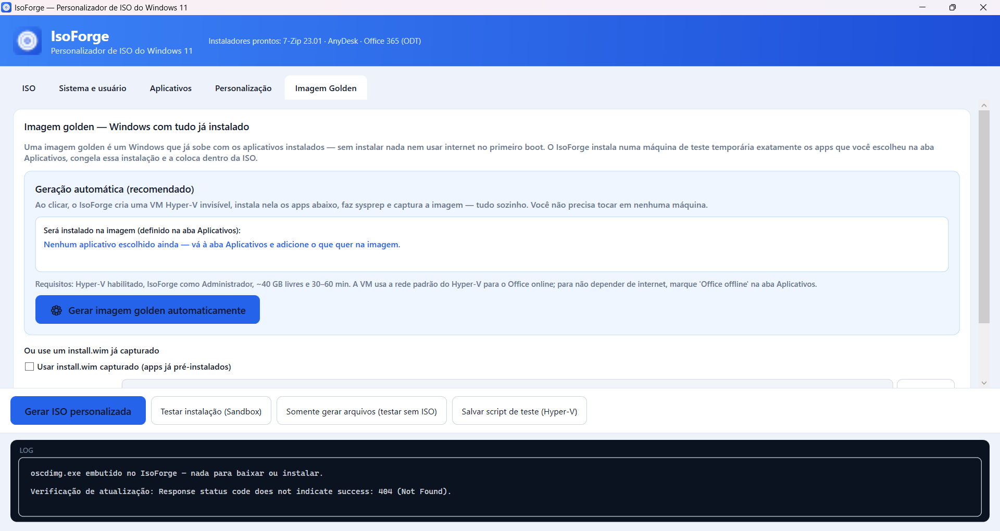

# IsoForge — Windows 11 ISO Customizer

**🌐 Language:** [Português](README.md) · **English**

**IsoForge** is a Windows app (single executable — nothing to install, not even .NET)
that takes an **official Windows 11 ISO** and produces a **customized, automated ISO**:
it creates the local user, installs your apps silently, configures VPN, appearance,
per-site machine naming, Entra ID join, and more — ready to boot and use.

Built for people who provision many machines (IT/support) and want a standardized,
few-clicks, from-scratch install.



---

## ✨ What it does

- **Two deployment modes:**
  - **Local account** — creates a local user (admin or standard), auto-logs in on first
    boot and installs the apps.
  - **Entra ID (work/school)** — first boot shows the corporate/school sign-in (Wi‑Fi +
    e‑mail + **Entra ID join**). The user signs in as a **standard** user, your local
    (admin) account is created in the background, and apps are installed as SYSTEM.
    Optionally **removes the setup user from the Administrators group**.
- **Silent app installation** at first logon: Office 365 (via ODT), AnyDesk, 7‑Zip,
  FortiClient, Adobe Reader and any `.exe`/`.msi`. IsoForge **auto-downloads** the latest
  versions of common apps.
- **Office offline** — embeds Office in the ISO (installs **without internet**), pinning
  the version so ODT doesn't reach the CDN.
- **Automatic disk selection (optional)** — in WinPE it picks the first fixed disk that is
  **not the USB stick**, partitions it and installs unattended. Falls back to manual if no
  safe disk is found.
- **Site selection** — a full-screen picker at first logon; the machine name becomes
  `PREFIX + BIOS serial`. Works without audit mode.
- **Pre-configured FortiClient VPN** — imports IPsec tunnels from a `.reg` captured from a
  configured FortiClient (native, reliable), with XAuth (prompt on login / save / disabled).
- **Appearance** — default wallpaper and lock screen (with fixes so it isn't black and
  applies immediately).
- **Skip Wi‑Fi in OOBE**, **hardware-requirement bypass** (TPM/Secure Boot/RAM/CPU),
  **edition key**, **pt‑BR language + ABNT2 keyboard**.
- **Golden image (Hyper‑V)** — optionally builds an image with everything pre-installed.
- **Test in Windows Sandbox** — one click installs the apps in a disposable Windows copy
  (just like the VM), with no risk to your machine.
- **Auto-update** — on launch, checks the latest GitHub release and offers to download/install.
- **Config saved locally** — everything you fill in is stored **encrypted with DPAPI** in
  `%APPDATA%\IsoForge\settings.dat` and survives updates. Nothing sensitive goes into the code.
- **Named profiles** — save/load multiple configurations (e.g., "HQ", "Client X").

---

## 🖥️ The tabs

| Tab | Purpose |
|---|---|
| **ISO** | Source ISO, output path, `oscdimg` (bundled) and **automatic disk selection**. |
| **System & user** | Deployment mode (Local × Entra ID), local user, password, machine name, edition, requirement bypass. |
| **Apps** | Add apps (auto-downloaded) and configure Office (online/offline). |
| **Personalization** | Wallpaper, lock screen, FortiClient VPN, site selection and scripts. |
| **Golden image** | Automatic (Hyper‑V) build of an image with everything pre-installed. |






---

## 🚀 How to use

1. Download and run **`IsoForge.exe`** (or install via `IsoForge-Setup.exe` from *Releases*).
2. On the **ISO** tab, select the official Windows 11 ISO and where to save the custom one.
3. On **System & user**, choose the **mode** and fill in the local user.
4. On **Apps**, add the programs (IsoForge downloads the installers).
5. (Optional) On **Personalization**, set VPN, wallpaper, site, etc.
6. Click **Generate custom ISO**.

> Everything you fill in is saved locally and reappears next time.

---

## 🧪 How to test (without wiping anything)

- **Test install (Sandbox)** — installs the apps in a disposable Windows copy (Windows
  Sandbox). Enable it once (PowerShell **as Admin**, then reboot):
  `Enable-WindowsOptionalFeature -Online -FeatureName Containers-DisposableClientVM -All`.
- **Save test script (Hyper‑V)** — creates a VM and boots the generated ISO (validates the
  full flow, including OOBE and user creation).
- **Only generate files** — produces `autounattend.xml` + the `Setup` folder for inspection.

---

## 🔄 Auto-update

On launch, IsoForge checks this repo's **latest release** on GitHub. If a newer version
exists, it offers to **download and install** it (with release notes and a "skip this
version" option).

---

## 🔒 Privacy / local data

- **No sensitive information** (IPs, passwords, PSKs, site names) lives in the code — the
  repository is clean and open.
- Everything you fill in is stored **only on your machine**, **encrypted with DPAPI** in
  `%APPDATA%\IsoForge\settings.dat`.
- The generated ISO contains the credentials you set (a limitation of Microsoft's
  mechanism) — treat the ISO as sensitive material.

---

## 🛠️ Build from source

Requires the **.NET 8 SDK**.

```powershell
# single self-contained executable
dotnet publish IsoForge.csproj -c Release
# output: bin\Release\net8.0-windows\win-x64\publish\IsoForge.exe

# tests (no ISO or UI needed)
dotnet run --project SmokeTest

# installer (requires Inno Setup 6)
& "$env:LOCALAPPDATA\Programs\Inno Setup 6\ISCC.exe" installer\IsoForge.iss
```

### Releasing a new version (CI/CD)

Build and publishing are automatic via GitHub Actions. To release:

```powershell
git tag v1.2.0
git push origin v1.2.0
```

The `Release` workflow compiles the executable, builds the installer and creates the
**release** with `IsoForge-Setup.exe` attached. Users get the update automatically.

---

## 📄 License

[MIT](LICENSE) — use, modify and distribute freely.
