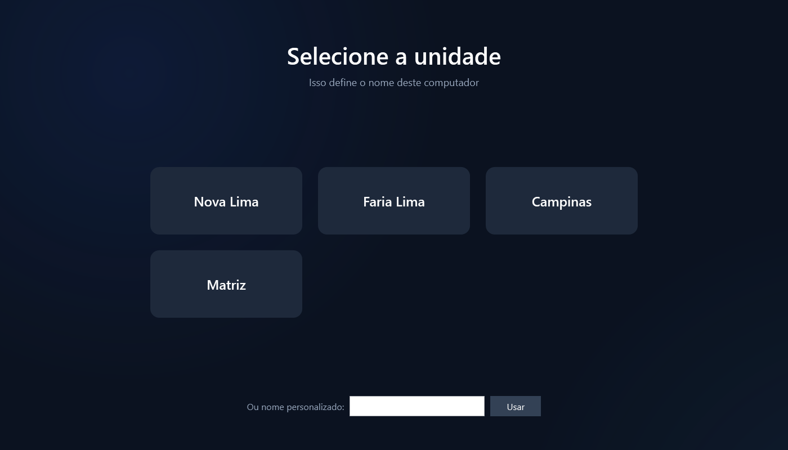
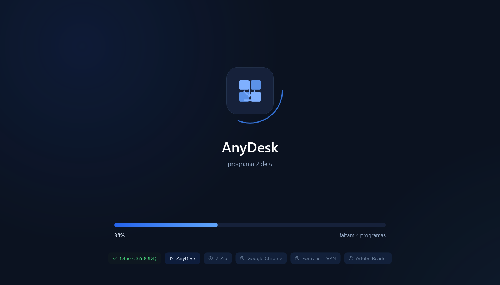
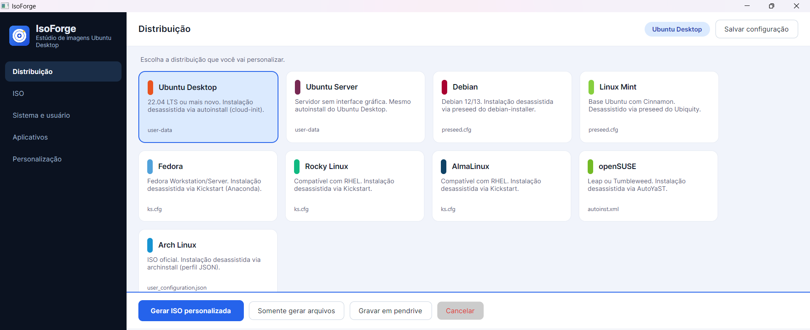
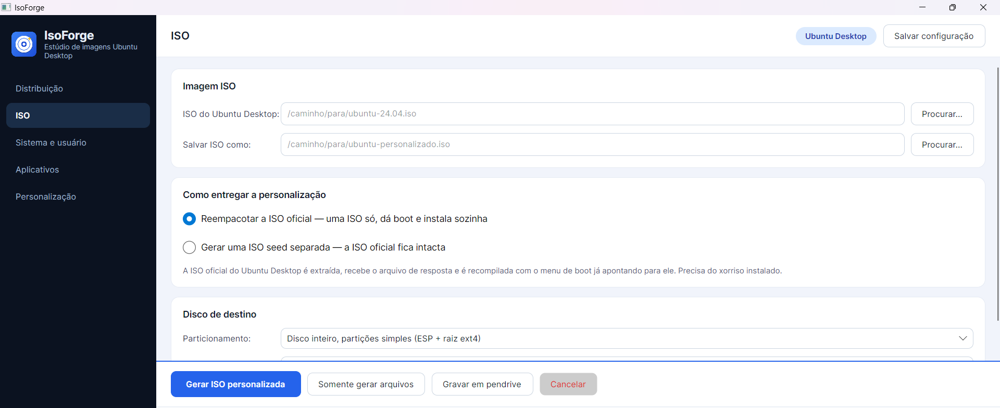
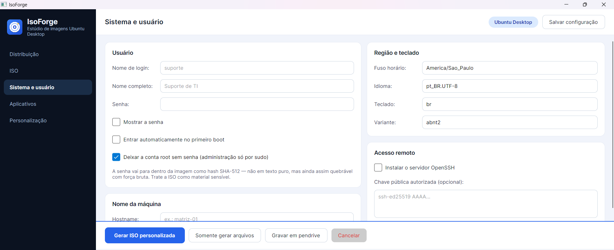
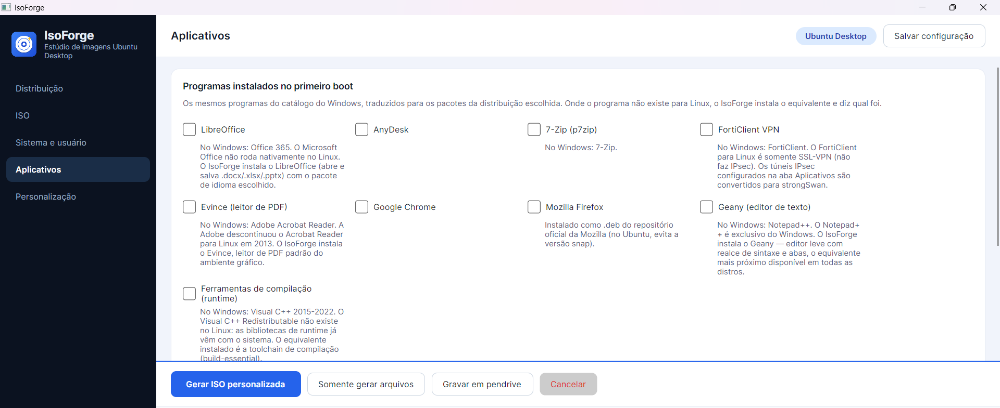
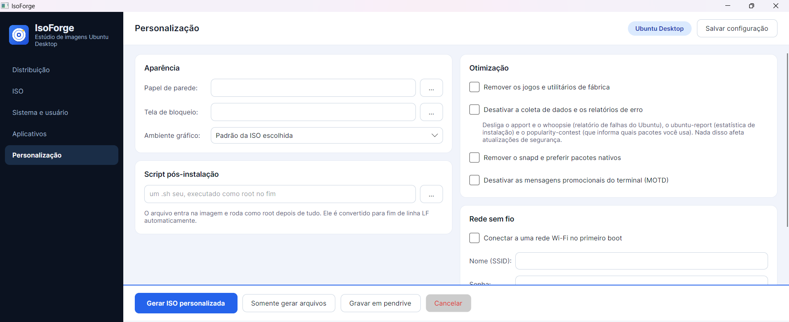
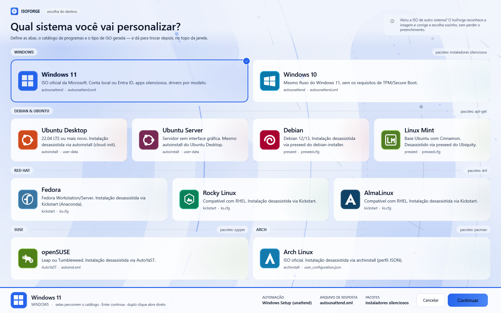
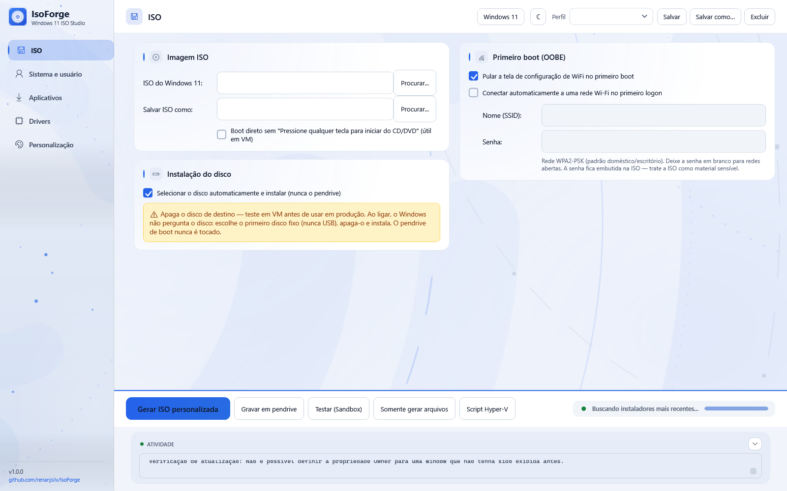

<div align="center">


# IsoForge

### Unattended Windows and Linux installs, from the official ISO

[](https://github.com/renanjsilv/IsoForge/releases/latest)
[](https://github.com/renanjsilv/IsoForge/releases)
[](LICENSE)

**Language:** [Português](README.md) · **English**

</div>

---

IsoForge takes an **official ISO** — Windows, or one of nine supported Linux distributions —
and gives you back **another ISO**, or a **bootable USB stick**, that installs the system on
its own: creates the user, injects the model's drivers, installs software silently, sets up
VPN and appearance, names the machine after its site, and reboots ready to use.

It was written for people who image a lot of machines and need them all to come out the same.

There are **two builds**: the Windows one, which customizes Windows and Linux ISOs, and the
**Linux** one, which customizes the distributions' ISOs. Both share the same core.

<div align="center">

</div>

---

## Download

None of these need .NET installed.

### Windows

| File | Who it's for |
|---|---|
| **IsoForge-1.0.0-Setup.exe** | Installs on the machine, with shortcuts and an uninstaller. The normal choice. |
| **IsoForge-1.0.0-portatil.zip** | Installs nothing: extract and run. Handy on a borrowed machine or from a USB stick. |

### Linux

| File | Who it's for |
|---|---|
| **IsoForge-1.0.0-amd64.deb** | Debian, Ubuntu, Mint: `sudo apt install ./IsoForge-1.0.0-amd64.deb` |
| **IsoForge-1.0.0-linux-x64.tar.gz** | Any distribution, 64-bit PC. Extract and run. |
| **IsoForge-1.0.0-linux-arm64.tar.gz** | Any distribution, 64-bit ARM. |

➡️ **[Get the latest release](https://github.com/renanjsilv/IsoForge/releases/latest)**

Every release lists the SHA-256 of every file so you can check what you downloaded.

### Requirements

**On Windows:**

- Windows 10 or 11 (64-bit)
- **Administrator** to build the ISO (mounting the image) and to write a USB stick
- ~15 GB free while building

**On Linux:**

- A graphical session (X11 or Wayland)
- **xorriso** — `sudo apt install xorriso` / `dnf install xorriso` / `pacman -S libisoburn`
- **bsdtar** or **7z**, for the mode that repacks the official ISO
- **pkexec** (policykit), if you want the program to write your USB stick

Either way: an official ISO of the system you are customizing.

> The interface is in Brazilian Portuguese.

---

## What it does

### Windows 10 and 11

- **Local account or Entra ID.** With a local account the user is already created and logs
  on automatically at first boot. With Entra ID the machine reaches OOBE asking for the
  corporate login, and the local administrator is created behind the scenes.
- **Skips the hardware requirements** (TPM, Secure Boot, RAM) so it installs on older gear.
- **Automatic disk selection** — picks the first fixed disk, never the boot USB stick.
- **Machine name per site.** The operator picks the branch on a full-screen page and the
  name comes out as `PREFIX + the unit's serial number`.

### Linux

Nine distributions, each through its own unattended mechanism:

| Family | Distributions | Answer file |
|---|---|---|
| Debian & Ubuntu | Ubuntu Desktop, Ubuntu Server, Debian, Linux Mint | `autoinstall` / `preseed` |
| Red Hat | Fedora, Rocky Linux, AlmaLinux | `kickstart` |
| SUSE | openSUSE | `AutoYaST` |
| Arch | Arch Linux | `archinstall` |

User, disk (optional LUKS), packages, VPN and appearance, all at first boot.

### Software

IsoForge downloads the latest 7-Zip, Chrome, Firefox, AnyDesk, Adobe Reader, Notepad++,
FortiClient VPN, Visual C++ and **Office 365** by itself, and embeds the installers in the
ISO. You can add your own too.

**Offline Office 365** is worth a note: IsoForge downloads the full payload (~3.6 GB) and
puts it inside the image, so the target machine installs Office **with no internet**.

### Drivers

Per-model injection for **Dell, Lenovo and HP** — IsoForge queries the vendor catalog,
downloads the pack for the chosen model and injects it into the image.

### While installing

Instead of a black terminal scrolling a script, the machine shows a full-screen page: the
site picker first, then progress with each program's icon.

<div align="center">


</div>

---

## IsoForge on Linux

The Linux build is the **same program**: the files under `Core/` and `Models/` are referenced
by both projects rather than copied, and they are the ones the test suite validates. Only the
shell differs — Windows uses WPF, which does not exist elsewhere; on Linux it is
[Avalonia](https://avaloniaui.net).

<div align="center">

</div>

It customizes **all nine distributions**, with everything the Windows build does for them:
user, disk (with optional LUKS), locale and keyboard, software, SSH, Wi-Fi, appearance,
tuning and a post-install script.

**What it does not do:** customize **Windows** ISOs. Driver injection needs DISM and rebuilding
the image needs `oscdimg`, and both are Windows tools with no practical equivalent elsewhere.
For Windows ISOs, use the Windows build.

### How it builds the ISO

| Step | Windows | Linux |
|---|---|---|
| Read the volume label | mounts the image | reads the ISO 9660 descriptor straight from the file |
| Extract | `Mount-DiskImage` + robocopy | `bsdtar`, `7z` or `xorriso -osirrox` |
| Rebuild | `oscdimg` (or xorriso) | `xorriso` |
| Write a USB stick | prepares GPT + FAT32 | `dd` of the image, through `pkexec` |

None of this needs root, **except** writing the USB stick.

### The screens

<div align="center">

| | |
|:--:|:--:|
|  |  |
| **ISO** | **System and user** |
|  |  |
| **Software** | **Appearance** |

</div>

On the **Aplicativos** tab every card says what will actually be installed: Office 365 becomes
LibreOffice, Adobe Reader becomes Evince, Notepad++ becomes Geany. The substitution is written
on screen and in the report instead of happening silently.

---

## Using it

1. **Pick the system** you are customizing. That decides the tabs, the software catalog and
   the kind of answer file produced.
2. **Point at the official ISO** and where to save the new one.
3. **Fill in what matters** — user, software, drivers, appearance. Anything you leave alone
   stays at its default.
4. **Build the ISO**, or **write straight to a USB stick**.

<div align="center">


</div>

### Try it before you wipe a disk

**Testar (Sandbox)** runs the whole provisioning inside Windows Sandbox — a throwaway copy
of Windows — without touching your machine.

With offline Office the test runs **with networking disabled**, on purpose: an offline test
with internet available would pass even with a broken local payload.

Sandbox is a Windows feature: the Linux build has no such button. To try a distribution ISO,
boot it in a virtual machine of your own (GNOME Boxes, virt-manager, QEMU) — and do that
before writing a stick that will wipe a real machine.

### Writing a USB stick

On Windows, **Gravar em pendrive** prepares the media directly, with no `.iso` in between:
GPT + FAT32, UEFI boot, and `install.wim` split into `.swm` when it exceeds FAT32's 4 GiB
limit. On Linux it is a `dd` of the image onto the device, which is how distribution ISOs
are meant to be written.

Either way: only removable disks are listed, the system disk never is, and the chosen disk
is re-checked at the moment of writing — the screen's copy doesn't count.

---

## About security

Two things users should know, said plainly:

**The generated ISO carries secrets.** The local account password and the Wi-Fi key go
inside the image in clear text, because that is how Windows unattended setup works.
**Treat the ISO as sensitive material**: whoever has the file has the passwords.

IsoForge limits the damage where it can: it locks down `C:\Setup` on the provisioned
machine (SYSTEM and Administrators only) and deletes the Wi-Fi profile from disk as soon
as the system imports it.

**Installers come from the internet.** On Windows, IsoForge downloads software from official
sites over HTTPS and embeds it in the ISO, where it runs as administrator. It verifies the
identity of what it downloads where the format allows, but not every download has a verified
vendor signature. If your environment requires it, point at your own installers. On Linux that
risk does not apply: nothing is embedded, software comes from the distribution's own repositories
with the distribution's signature.

**The local configuration is encrypted.** On Windows with DPAPI — the key belongs to your
Windows account, so copying `settings.dat` to another machine gets you nothing. Linux has no
DPAPI: the key is a `0600` file in your home directory and the data is AES-GCM. That stops a
backup or another user on the machine from reading it; it does **not** protect against someone
already logged in as you.

**What has not been exercised on hardware.** USB writing in the Linux build (a `dd` of the
image, elevated through `pkexec`) was written and reviewed but has never run against a real
stick. The generated ISOs are inspected from the inside on every CI push; they have not been
booted on physical hardware. Test in a VM before trusting them to wipe someone's machine.

---

## Development

```bash
git clone https://github.com/renanjsilv/IsoForge.git
cd IsoForge

dotnet build IsoForge.csproj              # the Windows app (WPF, .NET 8)
dotnet run   --project SmokeTest          # the Windows suite

dotnet build linux/IsoForge.Linux.csproj  # the Linux app (Avalonia, .NET 8)
dotnet run   --project SmokeTestLinux     # the Linux suite
```

The Windows suite has **728 checks** and needs no ISO, no network and no UI: it generates the
artifacts (`autounattend.xml`, `install.cmd`, the `.ps1` files, the Linux answer files) and
asserts things about them.

The Linux suite proves what can only be proven on that side, and **builds real ISOs** to do
it: it makes a source ISO with xorriso, has IsoForge repack it, then opens the resulting image
to check that the answer file made it in and that the GRUB menu came out with the unattended
boot parameters. It runs in CI on every push.

The Linux app also builds and runs on Windows and macOS — that is how the screenshots above
were taken.

Support tools:

```bash
dotnet run --project SmokeTest -- --dump <folder>   # dump the generated artifacts
dotnet run --project SmokeTest -- --odt             # probe the Office Deployment Tool
dotnet run --project SmokeTest -- --usb             # list visible USB disks (writes nothing)
```

### Cutting a release

Releases are tag-driven. Pushing a `vX.Y.Z` tag builds, runs the suite, produces the
installer and the portable build, computes the checksums and publishes everything:

```bash
git tag v1.0.1 && git push origin v1.0.1
```

---

## License

[MIT](LICENSE).

IsoForge distributes neither Windows nor any Linux distribution: it customizes an ISO
**you** already have. Respect the licensing of the system you are installing.
