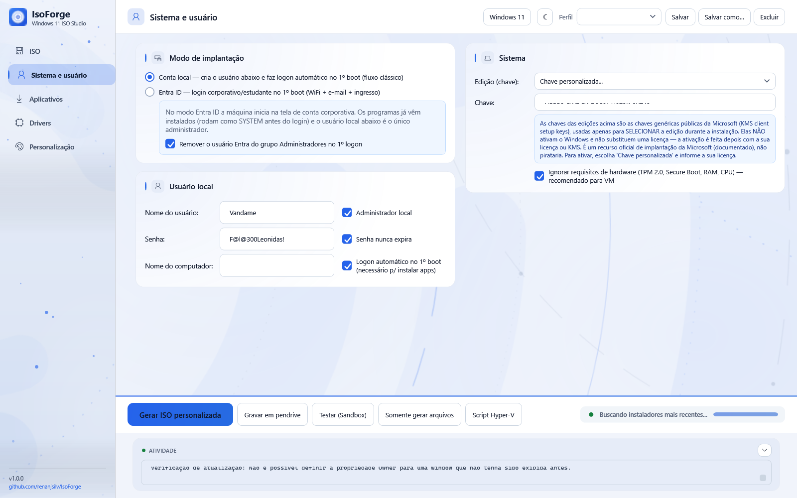
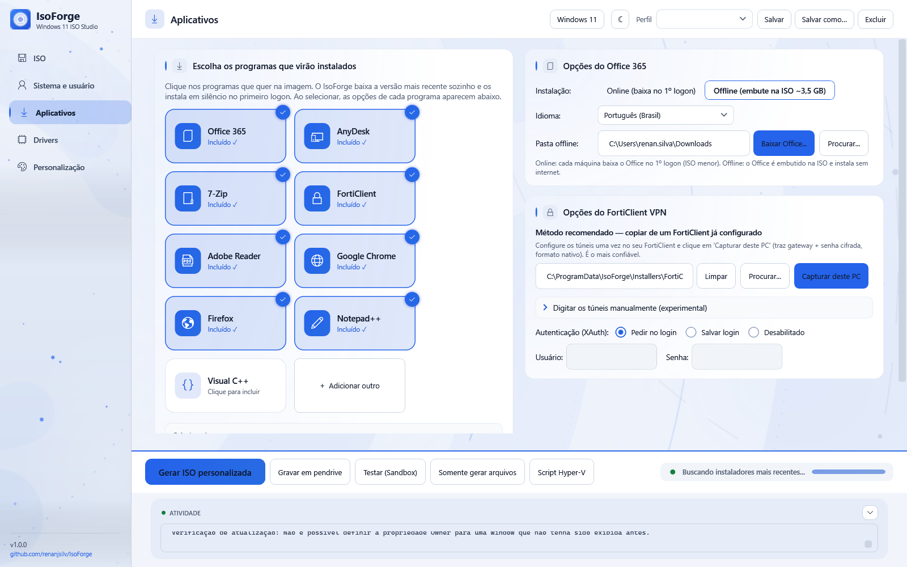
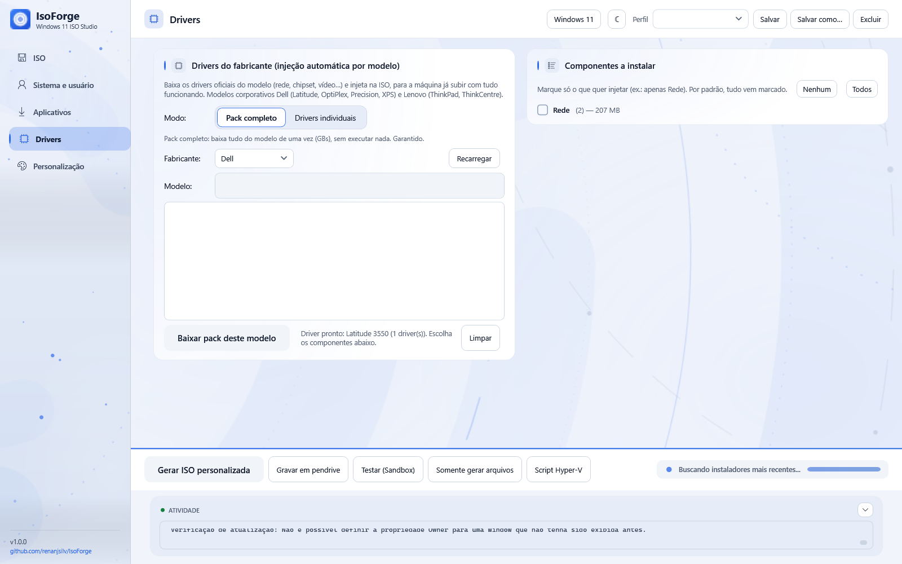
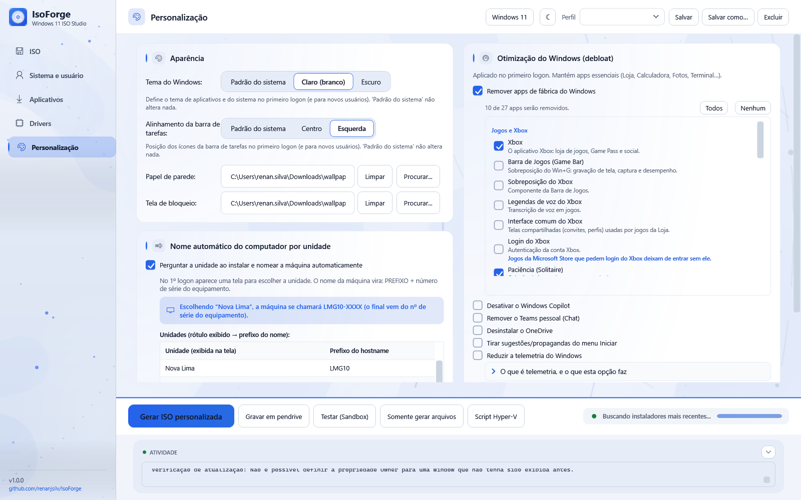

<div align="center">


# IsoForge

### Instalação desassistida de Windows e Linux, a partir da ISO oficial

[](https://github.com/renanjsilv/IsoForge/releases/latest)
[](https://github.com/renanjsilv/IsoForge/releases)
[](LICENSE)

**Idioma:** **Português** · [English](README.en.md)

</div>

---

O IsoForge pega uma **ISO oficial** — do Windows ou de uma das nove distribuições Linux
suportadas — e devolve **outra ISO**, ou um **pendrive inicializável**, que instala o sistema
sozinho: cria o usuário, injeta os drivers do modelo, instala os programas em silêncio,
configura VPN e aparência, nomeia a máquina pela unidade e reinicia pronta para uso.

Foi escrito para quem formata muitas máquinas e precisa que todas saiam iguais.

<div align="center">

</div>

---

## Baixar

Duas formas, com o mesmo programa dentro. Não é preciso ter o .NET instalado.

| Arquivo | Para quem |
|---|---|
| **IsoForge-1.0.0-Setup.exe** | Instala no computador, com atalhos e desinstalador. É a opção normal. |
| **IsoForge-1.0.0-portatil.zip** | Não instala nada: extraia e execute. Útil em máquina emprestada ou para levar num pendrive. |

➡️ **[Baixar a versão mais recente](https://github.com/renanjsilv/IsoForge/releases/latest)**

Cada release traz as somas SHA-256 dos dois arquivos, para conferir o que você baixou.

### O que é preciso ter

- Windows 10 ou 11 (64 bits)
- Uma ISO oficial do sistema que você vai personalizar
- **Administrador** para gerar a ISO (montar a imagem) e para gravar em pendrive
- ~15 GB livres durante a geração

---

## O que ele faz

### Windows 10 e 11

- **Conta local ou Entra ID.** Na conta local o usuário já vem criado, com logon automático
  no primeiro boot. No Entra ID a máquina chega ao OOBE pedindo o login corporativo, e o
  usuário administrador local é criado nos bastidores.
- **Pula os requisitos de hardware** (TPM, Secure Boot, RAM) para instalar em equipamento
  mais antigo.
- **Seleção automática de disco** — escolhe o primeiro disco fixo, nunca o pendrive de boot.
- **Nome da máquina por unidade.** O operador escolhe a filial numa tela em tela cheia e o
  nome sai como `PREFIXO + número de série do equipamento`.

### Linux

Nove distribuições, cada uma pelo mecanismo desassistido que ela própria usa:

| Família | Distribuições | Arquivo de resposta |
|---|---|---|
| Debian & Ubuntu | Ubuntu Desktop, Ubuntu Server, Debian, Linux Mint | `autoinstall` / `preseed` |
| Red Hat | Fedora, Rocky Linux, AlmaLinux | `kickstart` |
| SUSE | openSUSE | `AutoYaST` |
| Arch | Arch Linux | `archinstall` |

Usuário, disco (com LUKS opcional), pacotes, VPN e aparência, tudo no primeiro boot.

### Programas

O IsoForge baixa sozinho a versão mais recente de 7-Zip, Chrome, Firefox, AnyDesk,
Adobe Reader, Notepad++, FortiClient VPN, Visual C++ e **Office 365**, e embute os
instaladores na ISO. Você também pode adicionar os seus.

O **Office 365 offline** merece nota: o IsoForge baixa o pacote completo (~3,6 GB) e o
coloca dentro da imagem, então a máquina de destino instala o Office **sem internet**.

### Drivers

Injeção por modelo para **Dell, Lenovo e HP** — o IsoForge consulta o catálogo do
fabricante, baixa o pack do modelo escolhido e o injeta na imagem.

### Durante a instalação

Em vez de um terminal preto rolando script, a máquina mostra uma tela cheia: a escolha da
unidade primeiro, depois o progresso com o ícone de cada programa.

<div align="center">


</div>

---

## Como usar

1. **Escolha o sistema** que vai personalizar. Isso define as abas, o catálogo de programas
   e o tipo de arquivo de resposta gerado.
2. **Aponte a ISO oficial** e onde salvar a nova.
3. **Preencha o que interessa** — usuário, programas, drivers, aparência. O que você não
   mexer fica no padrão.
4. **Gere a ISO** ou **grave direto no pendrive**.

### Testar antes de formatar

O botão **Testar (Sandbox)** roda o provisionamento inteiro dentro do Windows Sandbox —
uma cópia descartável do Windows — sem tocar na sua máquina. É a forma de ver o que vai
acontecer antes de apagar o disco de alguém.

Com o Office offline, o teste roda **sem rede**, de propósito: um teste offline com
internet disponível passaria mesmo com o pacote local quebrado.

### Gravar em pendrive

O botão **Gravar em pendrive** prepara a mídia direto, sem passar por arquivo `.iso`:
GPT + FAT32, arranque por UEFI, e o `install.wim` é partido em `.swm` quando passa do
limite de 4 GiB do FAT32.

Só aparecem discos removíveis na lista. O disco do sistema nunca é listado, e o disco
escolhido é reconferido no instante da gravação — não vale o que a tela tinha em mãos.

---

## As telas

<div align="center">

| | |
|:--:|:--:|
|  |  |
| **Escolha do sistema** | **Sistema e usuário** |
|  |  |
| **Aplicativos** | **Drivers** |
|  |  |
| **Personalização** | **ISO** |

</div>

---

## Sobre segurança

Duas coisas que quem usa precisa saber, ditas sem rodeio:

**A ISO gerada carrega segredos.** A senha do usuário local e a do Wi-Fi vão para dentro
da imagem em texto, porque é assim que a instalação desassistida do Windows funciona.
**Trate a ISO como material sensível**: quem tem o arquivo tem as senhas.

O IsoForge reduz o estrago onde dá: ele fecha o `C:\Setup` na máquina provisionada
(só SYSTEM e Administradores) e apaga o perfil de Wi-Fi do disco assim que o sistema
o importa.

**Os instaladores vêm da internet.** O IsoForge baixa os programas dos sites oficiais por
HTTPS e os embute na ISO, onde rodam como administrador. Ele confere a identidade do que
baixa quando o formato permite, mas não há assinatura de fabricante verificada em todos.
Se o seu ambiente exige, aponte instaladores seus.

---

## Desenvolvimento

```bash
git clone https://github.com/renanjsilv/IsoForge.git
cd IsoForge
dotnet build IsoForge.csproj          # aplicativo (WPF, .NET 8)
dotnet run --project SmokeTest         # a suíte de testes
```

A suíte tem **728 verificações** e não precisa de ISO, de rede nem de interface: ela gera
os artefatos (`autounattend.xml`, `install.cmd`, os `.ps1`, os arquivos de resposta do
Linux) e afirma coisas sobre eles. Termina com `TODOS OS TESTES PASSARAM`.

Ferramentas de apoio, que também servem para suporte:

```bash
dotnet run --project SmokeTest -- --dump <pasta>   # despeja os artefatos gerados
dotnet run --project SmokeTest -- --odt            # sonda o Office Deployment Tool
dotnet run --project SmokeTest -- --usb            # lista os pendrives visíveis (não grava)
```

### Publicar uma versão

O release é dirigido por tag. Empurrar uma tag `vX.Y.Z` compila, roda a suíte, gera o
instalador e a versão portátil, calcula as somas e publica tudo:

```bash
git tag v1.0.1 && git push origin v1.0.1
```

---

## Licença

[MIT](LICENSE).

O IsoForge não distribui Windows nem nenhuma distribuição Linux: ele personaliza uma ISO
que **você** já tem. Respeite o licenciamento do sistema que está instalando.
